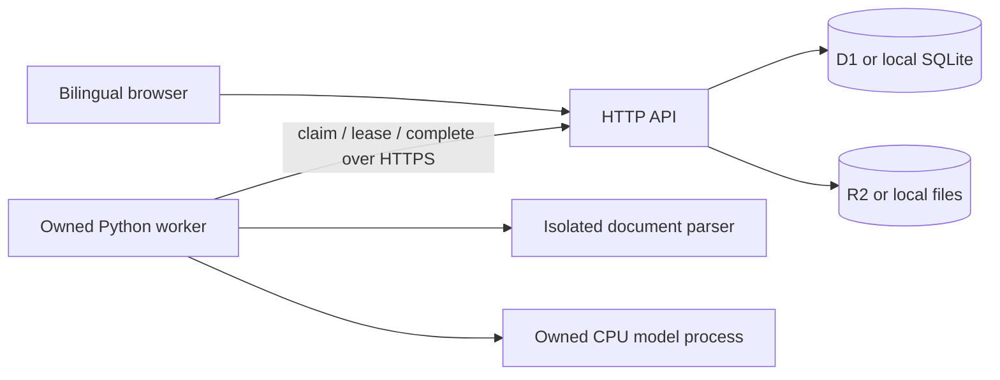

# Architecture

A purchasing operator creates a private comparison, uploads original files and reviews model-proposed fields before comparison. The API persists authoritative data; browser storage holds only language preference.

`server/api.ts` is a Fetch API handler. `server/worker.ts` supplies the hosted entrypoint; `server/local.ts` adapts Node HTTP. `server/local-platform.ts` implements the small D1/R2-compatible interface with native SQLite and a directory. Local migrations run before serving; cloud migrations are packaged for deployment.

## Data and state transitions

Sessions store only a hash of the random HttpOnly, SameSite cookie, with a seven-day expiry. Projects belong to sessions; document bytes live in blob storage. Every project, export, audit and source read checks ownership. A bearer secret authenticates the compute worker independently.

Uploads are SHA-256 identified and deduplicated within a project. The atomic insert enforces 6 documents per project, 200 stored documents globally and 16 queued/leased jobs. Anonymous sessions and projects are bounded. These limits provide demo capacity bounds, not a complete abuse-prevention or tenant billing system.

Jobs move `queued -> leased -> completed/failed/cancelled`. A single conditional UPDATE RETURNING claims work, creates a new token and increments attempts. Leases last 90 seconds and renew every 15 seconds. Expired leases can be reclaimed, up to 3 attempts. Every result write checks the token, state and deadline. Cancelled/deleted work cannot write a late result. Explicit retry can requeue failed work.

The worker downloads and verifies the exact file hash. Parsing runs in an owned subprocess with a 20-second timeout; POSIX additionally applies a 384 MB address-space limit (Windows does not). A separate owned llama-server process runs the model locally. Job failure, lost lease or cancellation stops that model process, instead of merely cancelling the HTTP client. Overall job deadline: 270 seconds. The worker can restart inference for the next job.

The original extraction and source lines remain recorded. Reviews are separate snapshots containing editable items and supplier/terms. A version-checked update and audit insertion share a transaction, so concurrent review saves return 409 instead of overwriting one another. Added manual rows have no model citation; users must inspect the source themselves.

## Comparison contract

Only rows explicitly marked reviewed participate. Grouping uses the exact human-supplied comparison key plus currency. Decimal arithmetic divides a pack price by an explicit pack size. Unknown price/unit/currency produces no normalized price. MOQ has its own unit and is never inferred from the price unit. Values remain strings through the financial calculation; display rounding is eight decimal places. CSV labels prices as excluding freight/tax and escapes formula-like cells.

Source-ID validation and number/unit checks catch some errors. They do not prove semantic grounding, establish equivalent products or prevent every prompt injection. There are no model tools, shell execution, remote URL fetching or order placement.

## Deployment and operations

Hosted API: Sites-managed Cloudflare Worker, D1 binding `DB`, R2 binding `QUOTES`. `.openai/hosting.json` declares only logical bindings. Runtime secret `WORKER_TOKEN` must match the compute worker's `QUOTE_WORKER_TOKEN` or token file. Do not put it in browser variables, source or a URL. The model stays on the operator's computer; no paid model endpoint is called.

The local server binds loopback by default. A hosted worker needs only outbound HTTPS access; no tunnel or inbound desktop port is required. Hardware offline means queued extraction, not lost reviews. `/api/health` reports database availability and the last model-worker heartbeat, not end-to-end model correctness.

Deleting a comparison deletes blobs then metadata; a storage error retains a retryable record. Expired data is reaped in bounded batches before claims. If the worker is offline, expiry removes browser access but cleanup waits. For private business use, self-host, control worker access, add identity/team authorization and backup/restore policies before relying on this as a system of record.
