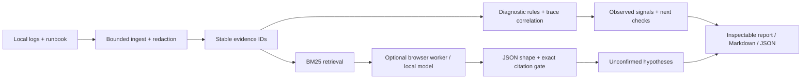

# Architecture and design decisions

**English** · [简体中文](ARCHITECTURE.zh-CN.md)

Incident Weave is a static application with a portable TypeScript analysis core. There is no evidence-processing server. UI, command line, evaluation and agent-tool adapters call the same implementation.

## Why these boundaries?

**Evidence first.** Logs and runbooks have different roles. A runbook saying “if a 429 occurs” must not count as an observed 429. Findings use only log sources; retrieval can return both. Every evidence record carries its source name, physical line number and an ID unique within the bundle.

**Lexical retrieval is intentional.** BM25 is cheap, reproducible, private and requires no embedding downloads. CJK bigrams support lexical Chinese matching. It does not understand paraphrases. Results use deterministic tie-breaking and reserve room for relevant sources before filling by score. We do not label this hybrid semantic search.

**Limited correlation beats confident speculation.** Continued work after cancellation requires the same source, a matching trace/run identifier and a later parsed ISO timestamp. An unrelated heartbeat or a line merely placed later in a file is insufficient. Multiple hosts must be normalized before cross-host correlation; v0.1 deliberately does not infer it.

**Generated output has two gates.** Model output must fit a bounded shape, and every citation must reference a selected, non-quarantined evidence line with an exact substring of at least eight characters. This rejects invented citations but cannot prove semantic entailment. Hypotheses never become confirmed observations through this gate.

**Cancellation has an owner.** Each inference attempt owns one Worker. Cancel, worker error, invalid response, successful completion or the ten-minute total budget terminates that worker. The earlier evidence report is immutable from the model adapter's perspective. The UI prevents competing runs and ignores stale completion after a view change.

**No background billing.** The public build is static. Importing evidence, retrieval, diagnostics and report export do not need a server or model. Model download requires an explicit click, and generation happens on the visitor's GPU. There is no fallback to a paid API.

**Language is presentation, not evidence rewriting.** `core/i18n.ts` selects a locale and translates application-owned copy/templates. `core/presentation.ts` localizes report narration without changing source names, physical lines, evidence IDs, exact quotes, user input, machine categories, digests or model claims. Switching languages keeps the current investigation. A new model run requests the chosen language while requiring verbatim evidence quotes; language compliance is not guaranteed. Unknown runtime diagnostics remain verbatim. JSON exports add a `language` field for the narration.

**Reproducible artifacts.** The SHA-256 digest covers the redacted evidence records and redacted question. Identical inputs have the same digest even though each run has a new UUID/timestamp. It is an integrity fingerprint, not an authenticity signature. JSON contains observations, selected context, exact quotes and measured stage times.

## Modules

| File                                      | Responsibility                                                                               |
| ----------------------------------------- | -------------------------------------------------------------------------------------------- |
| `core/engine.ts`                          | Input limits, redaction, BM25, diagnostic rules, correlation, citation validation, reporting |
| `core/local-ai.ts`                        | Worker lifecycle, cancellation, wall-clock budget, validation of returned JSON               |
| `core/model.worker.ts`                    | Load the open model and perform one local inference                                          |
| `core/fixtures.ts` / `core/evaluation.ts` | Synthetic scenarios and a deterministic evaluation runner                                    |
| `core/webmcp.ts`                          | Optional tools with the same input validation and visible state transition                   |
| `app/page.tsx`                            | Input, run state, evidence inspection, local history and exports                             |
| `scripts/investigate.ts`                  | Network-free CLI adapter                                                                     |

## Extensions worth pursuing

Add a concrete failing fixture before extending behavior. Useful next steps include explicit OpenTelemetry span ingestion, trace-aware retrieval ranking, a measured local semantic retriever, an evaluated stronger-model option, and conflict detection between runbooks and observed configuration. These are future work, not implemented features.
