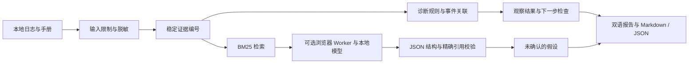

# 架构与设计取舍

**简体中文** · [English](ARCHITECTURE.md) · [项目首页](../README.zh-CN.md)

本项目是静态应用，使用可移植的 TypeScript 分析核心，没有证据处理服务器。界面、命令行、评估和 Agent 工具适配器调用同一实现。

## 这些边界为什么重要

**区分证据角色。** 手册中的“如果出现 429”不代表运行时真的发生了 429。诊断仅使用日志，检索可以返回两种来源。每条证据保留来源名、物理行号和本次材料内唯一的编号。

**采用词法检索。** BM25 成本低、可复现、无需下载嵌入模型。中文二元词组支持中文词法匹配，但不理解同义改写。结果通过稳定排序和来源多样性选择；这不是语义或混合检索。

**限制关联条件。** 取消后仍有活动，需要来源相同、trace/run 编号相同、解析后的 ISO 时间更晚。无关心跳或仅排在文件后面的行不足以成立。当前版本不自动推断跨主机事件关联。

**模型输出经过两道检查。** 输出结构和长度必须符合边界，每条引用必须属于提供给模型的、未隔离的证据，且为至少八个字符的精确子串。这能拒绝编造引文，不能证明语义支持或因果成立，也不会把假设升级成确认事实。

**取消遵循所有权。** 每次模型运行拥有一个 Worker。取消、错误、无效响应、成功完成或十分钟预算耗尽都会终止它。适配器不修改此前完成的证据报告；界面阻止竞争运行，并忽略过期结果。

**无需后台推理费用。** 公开部署为静态网页。用户主动启用模型后才会下载文件并使用本机 GPU。基础证据分析和导出无需模型，也没有付费 API 回退路径。

**语言是展示层。** `core/i18n.ts` 管理界面文案、受控模板和语言优先级。`core/presentation.ts` 只翻译应用自身生成的报告叙述，保留用户问题、来源、证据、引文、机器类别、摘要指纹和已生成的模型内容。语言切换不清空输入。新模型运行会请求当前语言，原文引用仍不得翻译；无法保证小模型总能遵从语言要求。未知运行时错误保留技术原文。

**报告可复现。** SHA-256 覆盖脱敏证据和脱敏问题，同样输入产生相同指纹；每次运行的 UUID 和时间独立。指纹不是作者身份签名。JSON 导出的 `language` 描述报告叙述语言，字段名保持稳定。

## 模块

| 文件                                      | 职责                                                       |
| ----------------------------------------- | ---------------------------------------------------------- |
| `core/engine.ts`                          | 输入上限、脱敏、BM25、规则、关联、引用校验和 Markdown 导出 |
| `core/i18n.ts` / `core/presentation.ts`   | 语言选择、中英文文案和保留证据的报告本地化                 |
| `core/local-ai.ts`                        | Worker 生命周期、取消、预算与结果校验                      |
| `core/model.worker.ts`                    | 加载开放模型，执行一次本地推理                             |
| `core/fixtures.ts` / `core/evaluation.ts` | 双语合成场景和确定性评估                                   |
| `core/webmcp.ts`                          | 共用输入校验与页面状态的可选工具                           |
| `app/page.tsx`                            | 输入、语言、任务状态、证据检查、历史和导出                 |
| `scripts/investigate.ts`                  | 无网络请求的命令行入口                                     |

## 后续扩展

先添加具体的失败案例，再扩展功能。可研究结构化 OpenTelemetry 导入、按 trace 排序的检索、经过测量的本地语义检索、更强模型评估、手册与实际配置的冲突检测。这些是后续方向，当前尚未实现。
