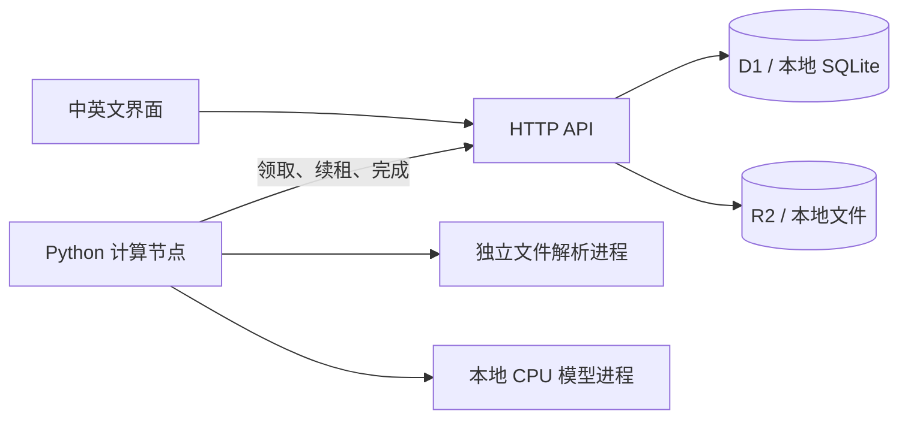

# 架构与数据约定

浏览器用于导入与人工核对；服务端保存权威数据；计算节点只通过出站 HTTPS 领取任务、续租和回传结果。云端无需暴露用户电脑端口。

云端入口是 `server/worker.ts`；本地入口 `server/local.ts` 使用 Node HTTP。两者共享 `server/api.ts`，本地适配层实现与 D1/R2 相同的小型接口。Drizzle 迁移负责云端建表，本地启动时应用相同迁移。浏览器本地存储只保存语言偏好。

## 数据归属与任务

随机 HttpOnly、SameSite Cookie 建立七天私有会话，数据库只保存其哈希。比价组属于会话；每个文件、导出和审计接口都校验归属。模型节点使用独立 bearer secret，不使用访问者 Cookie。

上传按 SHA-256 在组内去重。原子插入限制每组 6 份文件、全局 200 份存储、16 个等待或执行任务；会话和组数也有上限。这些是演示容量限制，不能替代完整反滥用或多租户计费系统。

任务按 `queued -> leased -> completed/failed/cancelled` 流转。单条条件 UPDATE RETURNING 领取任务，每次生成新令牌并增加尝试次数；租约 90 秒，15 秒续租。最多自动领取三次。过期恢复后旧令牌不可回写；取消或删除后的结果也会被拒绝。

解析使用可终止的独立进程，20 秒超时；POSIX 还限制 384 MB 地址空间，Windows 暂无此内存硬限制。模型也是计算节点拥有的独立进程。任务失败、取消或丢失租约时终止该进程，不能仅取消 HTTP 请求就假设算力释放。完整任务最长 270 秒。

原始提取结果保留不变，人工核对另存快照，包括供应商、条款和商品。版本条件更新与审计写入在同一事务中；并发保存冲突返回 409。可以补录遗漏行，但手工行没有模型引用，应自行核对原文。

## 比价约定

只有明确勾选并保存的行参与比较。相同比价组名称且币种相同才归在一起；整箱价格只有在包装件数明确时才用十进制除法换算为每件价。缺少价格、币种或单位时不产生换算值。起订量单位独立保存，不能借用报价单位。

金额以十进制字符串传递，换算展示精度为小数点后八位。导出明确标注不含运费税费，并处理公式型文本。系统不自动汇率换算、不证明商品规格相同、不按运费税费评出总成本赢家。

引用 ID 和原文数字检查只能发现部分错误，不能证明语义正确或完全防止提示注入。模型没有调用工具、执行命令、请求文档内链接和下单的能力。

## 运行与存储

云端使用 Sites 管理的 Cloudflare Worker、D1 `DB`、R2 `QUOTES`。云端 `WORKER_TOKEN` 须与计算节点令牌一致；不要写进前端、URL 或 Git。本地服务默认只监听回环地址。电脑离线时排队提取，已保存资料仍可访问；健康接口显示节点最近心跳，不等于模型准确率证明。

主动删除先删文件再删记录，存储错误保留可重试的记录。七天过期后失去访问权；清理在计算节点下次取任务时分批执行。用于真实企业资料前，应自行部署、增加身份与团队权限、制定备份恢复策略。不要把公开演示当业务资料库。
